# Olist E-commerce Performance & Strategic Insights: A Case Study Dashboard

---

## 1. Executive Summary

This project presents a comprehensive, interactive dashboard analyzing the historical performance of Olist, a Brazilian e-commerce platform. Utilizing Olist's operational history, notably its **subsequent insolvency due to high operational debt**, this analysis moves beyond mere metrics to extract crucial strategic insights and derive invaluable lessons for sustainable e-commerce growth.

Our findings reveal critical patterns, including a significant reliance on one-time buyers (over 99% of customers were single-purchase), regional logistics cost disparities, and a strong correlation between seller delivery efficiency and overall performance. The analysis highlights the imperative of customer retention and optimized logistical management. This dashboard, built with Streamlit and Plotly, provides actionable recommendations to mitigate common e-commerce pitfalls and foster robust, data-driven decision-making, emphasizing customer lifetime value and cost efficiency.

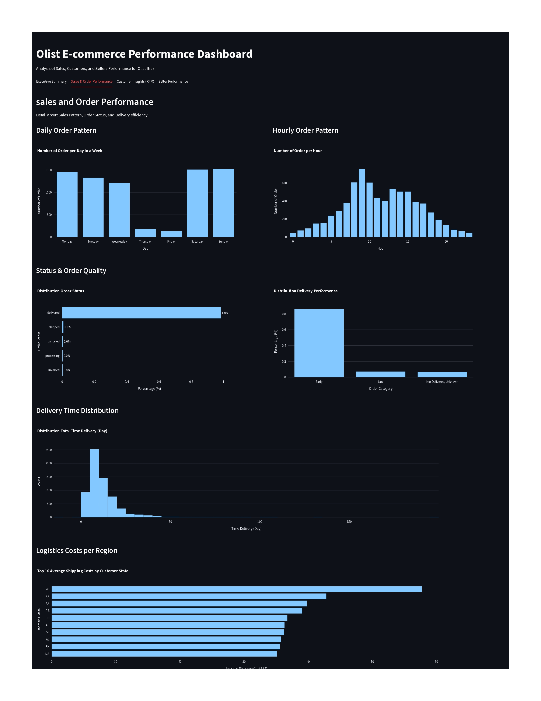

---

## 2. Business Problem: Lessons from Olist's Operational Challenges

Olist's eventual insolvency, stemming from accumulated operational debt, serves as a compelling case study illustrating the critical need for rigorous data analytics in e-commerce. While growing, Olist faced underlying systemic issues that ultimately led to its downfall. This project addresses the challenge of retrospectively analyzing a vast transactional dataset to pinpoint the contributing factors to such operational burden and extract lessons for future enterprises.

Specifically, the analysis aims to:

- Identify subtle sales patterns and anomalies that might indicate underlying issues.
    
- Evaluate customer value and purchasing behavior, critically assessing the prevalence and impact of one-time buyers versus loyal customers.
    
- Assess the true efficiency of operational processes, particularly in order fulfillment and logistics.
    
- Pinpoint contributing factors to financial strain, such as disproportionately high logistics costs in certain regions or revenue leakage from suboptimal sales days.
    
- Ultimately, derive actionable insights and cautionary lessons that promote sustainable growth and operational resilience within the broader e-commerce landscape.
    

---

## 3. Data Source

The project utilizes the **Olist E-commerce Public Dataset**, hosted on Kaggle. This robust dataset encompasses information on 100,000 orders placed at Olist stores in Brazil from 2016 to 2018. It provides a multi-dimensional view of the e-commerce ecosystem, including order status, detailed customer and seller geographical locations, diverse product categories, various payment methods, and valuable customer review scores.

---

## 4. Methodology & Architecture

The project's analytical framework prioritizes modularity and efficiency, ensuring a clear separation of concerns from data ingestion to dashboard presentation.

### 4.1. Project Structure

(Keep your existing project structure diagram/description here, if any specific image for it is available)

![[architecture_diagram.png]]

### 4.2. Data Processing & Analysis Pipeline

1. **Raw Data Ingestion:** Initial loading of various Olist CSV files into a structured environment.
    
2. **Data Cleaning & Preprocessing:** Rigorous handling of missing values, meticulous correction of data types, precise conversion of timestamps, and comprehensive addressing of inconsistencies to ensure data integrity.
    
3. **Feature Engineering:** Creation of new, insightful metrics crucial for advanced analysis, including `total_revenue`, `delivery_time`, `avg_delivery_vs_estimate`, and Customer RFM (Recency, Frequency, Monetary) scores.
    
4. **Aggregation & Summarization:** Raw data is efficiently aggregated into optimized summary DataFrames (e.g., monthly sales, daily/hourly patterns, RFM segments, seller performance profiles) to significantly enhance dashboard loading times and interactivity.
    
5. **Data Export:** All summarized and processed DataFrames are persistently saved as Parquet/CSV files within the `data/processed/` directory for streamlined dashboard access.
    

### 4.3. Key Analytical Techniques Employed

- **Time-Series Analysis:** Granular examination of sales and order trends on monthly, daily, and hourly bases to discern temporal patterns and anomalies.
    
- **RFM (Recency, Frequency, Monetary) Analysis:** Sophisticated segmentation of the customer base based on their purchasing behavior, crucial for identifying high-value, loyal, and at-risk customer segments.
    
- **Delivery Performance Metrics:** Meticulous calculation of actual delivery times against estimated times to precisely assess logistical efficiency and identify bottlenecks.
    
- **Seller Performance Metrics:** Comprehensive evaluation of sellers based on their total revenue contribution, order volume, and adherence to delivery punctuality, identifying top performers and areas for improvement.
    
- **Geographic & Category Analysis:** In-depth understanding of performance distribution across various customer states and distinct product categories, revealing regional and market-specific insights.
    

---

## 5. Key Insights & Interactive Visualizations

The interactive dashboard, powered by **Streamlit** and **Plotly**, offers a multi-tabbed interface, transforming complex data into compelling visual narratives that reveal critical operational realities of Olist.

### 5.1. Executive Summary: The Macro View

This tab provides a high-level overview of Olist's performance. **KPI Cards** offer immediate insight into crucial overall metrics like Total Revenue, Total Orders, Average Order Value, and Unique Customer/Seller counts, alongside Delivery Performance (On-time/Early Percentage). **Monthly trend visualizations** for total revenue and unique orders distinctly show growth patterns and, critically, highlight the sharp decline in September 2018, directly correlating with Olist's reported insolvency. This visualization immediately sets the stage for the underlying challenges.

### 5.2. Sales & Order Performance: Operational Deep Dive

This section dissects the operational efficiency and sales patterns.

- Daily & Hourly Order Patterns clearly reveal Olist's busiest periods, with peak operational times evident on weekends and specific hours (e.g., 9 AM - 3 PM). This insight is vital for optimizing staffing and logistics.
    
  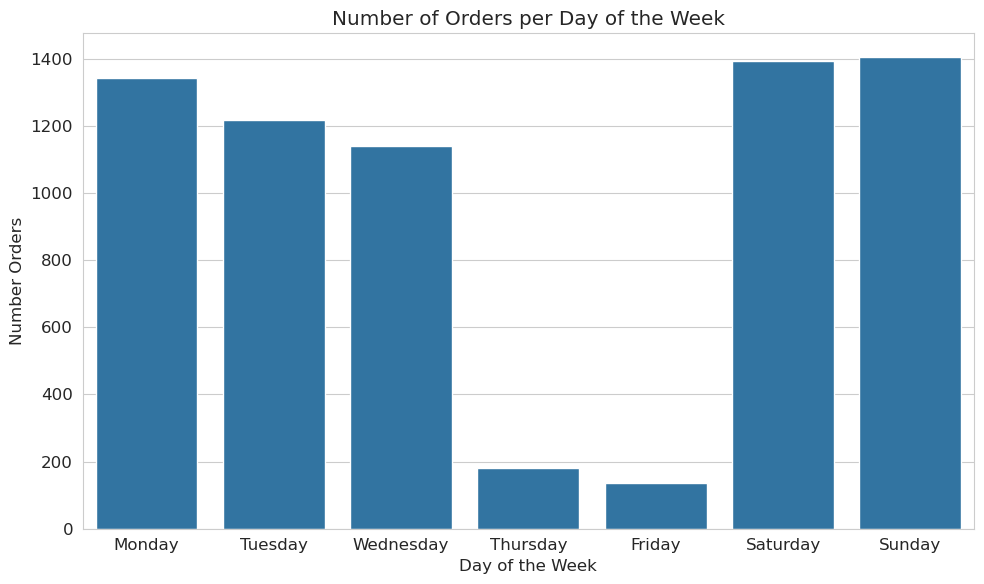
    
- The Order Status Distribution confirms a high efficiency in order fulfillment, with 98.22% of orders successfully delivered. This suggests fulfillment was not the primary issue, but rather other cost centers.
    
    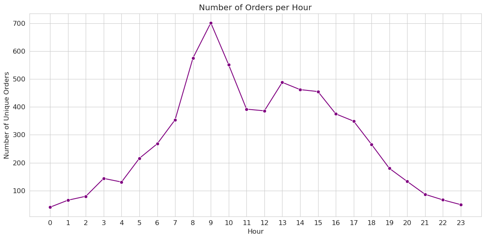
    
- Delivery Performance & Time Distribution further supports this, illustrating that 86% of deliveries were ahead of or on schedule, indicating robust logistical execution at the micro-level.
    
  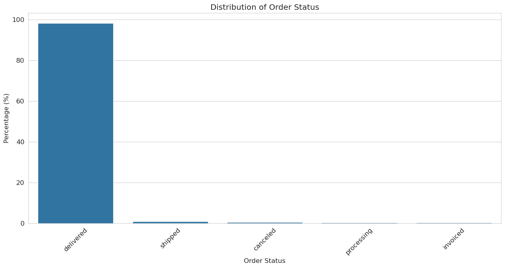
    
- However, Logistics Costs by Region uncovers a significant hidden operational burden: certain regions like Rondônia (RO), Roraima (RR), and Amapá (AP) exhibited disproportionately higher average freight values, suggesting an unsustainable cost structure for serving these areas.

  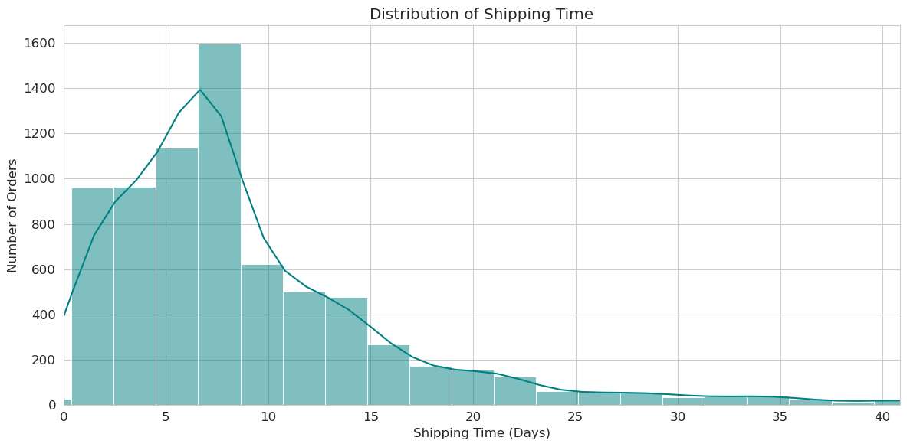
    

### 5.3. Customer Insights (RFM): The Retention Challenge

This crucial section uncovers Olist's fundamental challenge in customer retention.

- The RFM Segment Distribution critically shows that over 99% of Olist's customer base were one-time buyers. This alarming metric highlights a severe lack of customer loyalty and repeat business, a primary contributor to unsustainable revenue streams and high customer acquisition costs.

  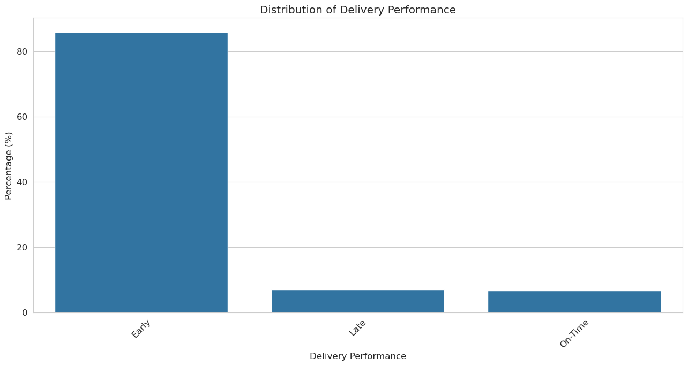
    
- Despite this, the "Single Buyers (Moderate Recency & High Monetary)" segment stood out with the highest average Monetary value (nearly R$600), indicating that  while customers might not return, a subset made substantial initial purchases. This suggests opportunities for targeted high-value one-off sales or, with better retention strategies, converting these into loyal customers.
    
    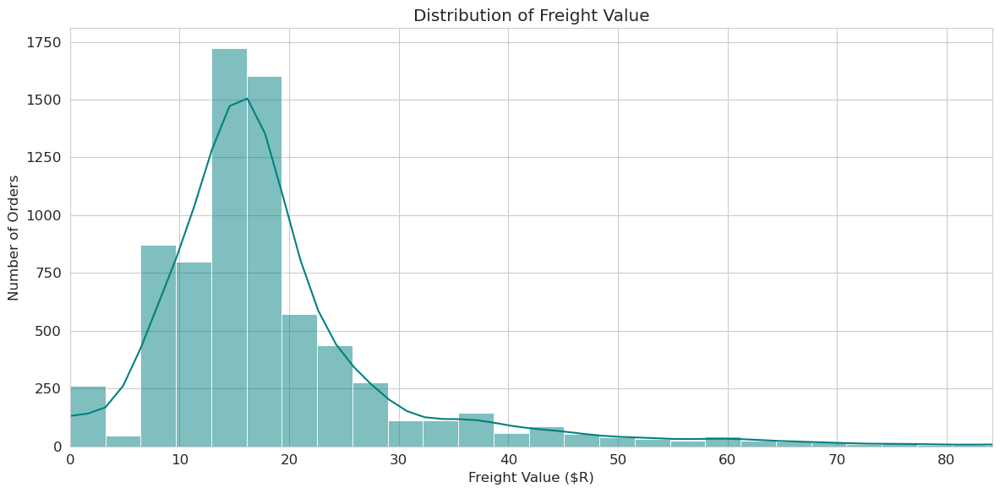
    
- Segment Characteristics allowed for deeper exploration; for instance, beleza_saude (health & beauty) products were notably popular among the small segment of Champions, suggesting potential for nurturing specific high-value categories.
    
    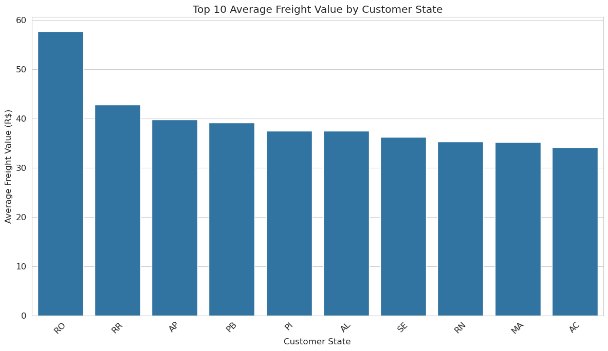
    
- **Delivery Performance by RFM Segment** consistently showed early delivery across all customer groups, implying that delivery speed was not a deterrent to customer retention.
    

### 5.4. Seller Performance: The Backbone of Operations

This tab evaluates the health of Olist's seller ecosystem.

- Top Sellers by Revenue & Order Volume identify crucial contributors, such as a top seller generating ~R$20,000 in revenue (4869f7a5dfa277a7dca6462dcf3b52b2) and another processing over 150 orders (4a3ca9315b744ce9f8e9374361493884). These "star sellers" are vital for platform stability.
    
    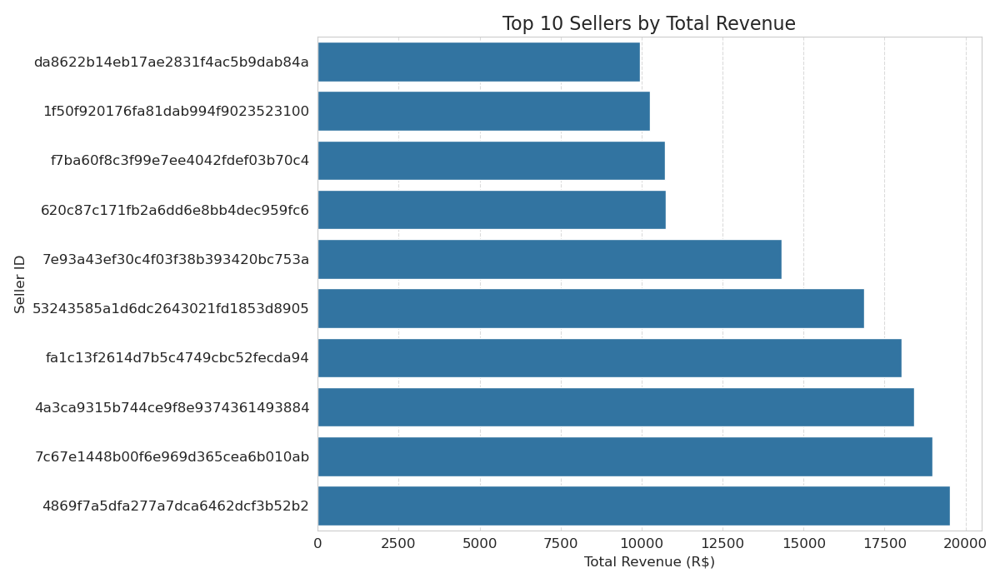  
    
    
- The Seller Delivery Efficiency analysis, through scatter plots of total orders, revenue, and average delivery times, conclusively demonstrates that the majority of sellers consistently delivered orders ahead of their estimated dates. This indicates strong seller adherence to logistical expectations, shifting the focus of operational debt away from seller-side delays.

    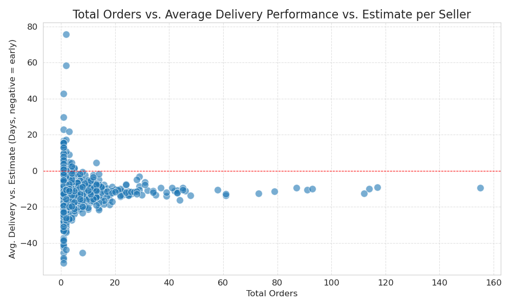
    
    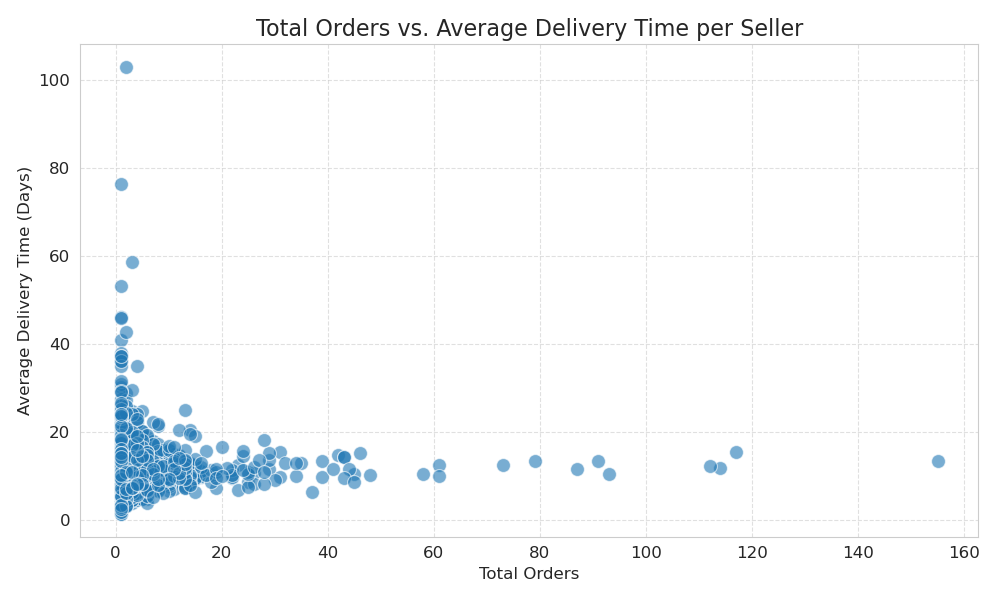  
    

### Interactive Filters: Empowering Deeper Exploration

The dashboard is equipped with dynamic sidebar filters, including **Date Range (Month/Year)**, enabling stakeholders to analyze trends and performance over specific periods, fostering agile decision-making.

---

## 6. Actionable Recommendations for Sustainable E-commerce Growth

Based on the strategic insights derived from Olist's operational data, the following recommendations are critical for any e-commerce platform aiming for sustainable growth and avoiding similar pitfalls:

1. **Prioritize Customer Retention:** Implement aggressive strategies to convert one-time buyers into repeat customers. This includes loyalty programs, personalized marketing campaigns, post-purchase engagement, and incentives for subsequent purchases. The "Single Buyers (Moderate R & High M)" segment represents a key target for these efforts.
    
2. **Optimize Logistics Cost Management:** Conduct a thorough review of freight costs, especially for high-cost regions (e.g., RO, RR, AP). Explore alternative shipping partners, negotiate better rates, or adjust pricing/delivery options for these areas to ensure profitability is maintained across all service regions.
    
3. **Leverage Peak Performance Data:** Utilize insights from daily and hourly order patterns to optimize staffing, inventory levels, and marketing spend during peak times (weekends, 9 AM - 3 PM), maximizing revenue capture and operational efficiency.
    
4. **Strategic Seller Empowerment:** Continue fostering relationships with high-performing sellers who consistently deliver on time and generate significant revenue. Implement programs to incentivize their growth and potentially replicate their success metrics across the seller base.
    
5. **Continuous Data Monitoring:** Establish a robust system for ongoing data analysis and dashboard monitoring to detect early warning signs of declining customer retention, rising operational costs, or shifting demand patterns before they lead to critical issues.
    

---

## 7. Technologies Used

- **Python:** Core programming language for data manipulation and analysis.
    
- **Pandas:** Essential library for high-performance data structures and analysis.
    
- **Streamlit:** Framework for building fast, interactive web applications and dashboards.
    
- **Plotly Express:** Used for creating visually appealing, interactive, and informative charts.
    
- **NumPy:** Fundamental package for numerical computation in Python.
    

---

## 8. Author

- **[Rizki Romdhoni]** - [LinkedIn Profile](https://www.linkedin.com/in/rizki-romdhoni/)
    

---

## 9. License

This project is open-sourced under the [MIT License](https://opensource.org/licenses/MIT).

---
